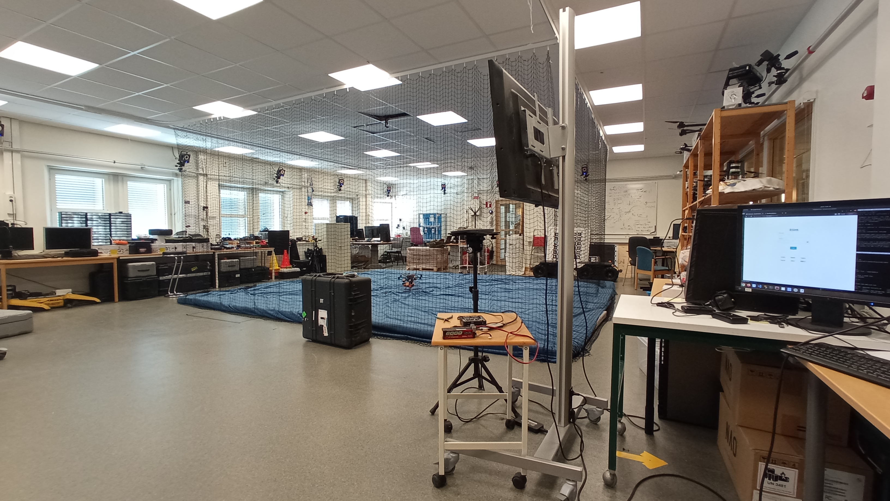
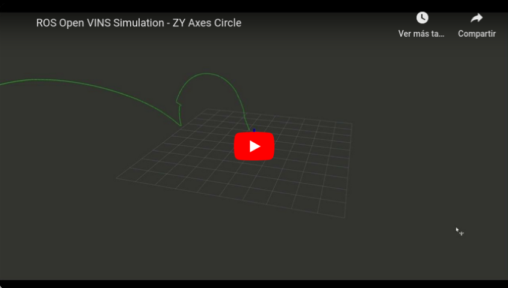

# OpenVINS Implementation and VIO Testing

## Table of Contents
1. [Introduction](#introduction)
    1. [About LTU's Robotics & AI Team](#about-ltus-robotics-and-ai-team)
    2. [About ROS](#about-ros)
    3. [About OpenVINS](#about-openvins)
        1. [What is Visual Inertial Odometry (VIO)?](#what-is-visual-inertial-odometry-vio)
        2. [What are Visual Inertial Navigational Systems (VINS)?](#what-are-visual-inertial-navigational-systems-vins)
        3. [What is SLAM?](#what-is-slam)
2. [Research Methodology](#research-methodology)
    1. [Installation (Ubuntu Focal 20.04)](#installation-ubuntu-focal-2004)
    2. [Simulation](#simulation)
    3. [IMU & Camera Calibration](#imu-and-camera-calibration)
    4. [Hands-on Evaluation](#hands-on-evaluation)

## Introduction

### [About LTU's Robotics and AI Team](https://www.ltu.se/research/subjects/RoboticsAI?l=en)

LTU's Robotics & AI lab is a specialized facility where researchers, engineers, and students work on various aspects of robotics. It is equipped with state-of-the-art hardware and software tools that enable the design, development, and testing of robotic systems. 

The lab serves as a creative and collaborative space for exploring innovative solutions, integrating artificial intelligence, and advancing the field of robotics. It provides an ideal environment for hands-on learning, experimentation, and pushing the boundaries of technological advancements in robotics.

<table>
<tr>
<td></td>
<td></td>
</tr>
</table>

### [About ROS](https://www.ros.org/)

The Robot Operating System (ROS) is a set of open source software libraries and tools that help you build robot applications. The version used was ROS Noetic Ninjemys, the latest ROS 1 LTS Release targeted at the Ubuntu 20.04 (Focal) release. Some of its key features include:

* Middleware Communication through a set of nodes (independent software modules) that publish and subscribe to data, making it easy to exchange information within the robot's ecosystem.

* Package Management: ROS uses a package-based architecture, where functionalities are organized into individual packages.

* Hardware Abstraction: ROS provides hardware abstraction, allowing developers to interface with various sensors, actuators, and robots in a standardized way.

* Visualization and Debugging: ROS includes visualization tools that help developers monitor and debug the robot's behavior, visualize sensor data, and understand the system's state during runtime.

* Language Support: ROS supports multiple programming languages, with Python and C++ being the most commonly used.

### [About OpenVINS](https://github.com/rpng/open_vins)

#### What is Visual Inertial Odometry (VIO)?

Visual Inertial Odometry (VIO) is a technology used in robotics, computer vision, and augmented reality to estimate the position and orientation (pose) of a camera or an object in a 3D environment. It combines information from both visual sensors (cameras) and inertial sensors (such as accelerometers and gyroscopes) to track the motion of the camera or object accurately.

Visual information from the camera helps to track features and detect relative changes in position and orientation with respect to the surroundings. Meanwhile, the inertial sensors provide information about the camera's acceleration and rotation rates, helping to improve motion estimation.

#### What are Visual Inertial Navigational Systems (VINS)?

Visual Inertial Navigational Systems (VINS), similarly to VIO, utilizes both visual and inertial data to track the movement of the system. VINS not only includes odometry but also incorporates state estimation and navigation. 

VINS aims to provide real-time, continuous localization and navigation updates for the system. It involves a more sophisticated fusion of visual and inertial data, often using techniques from probabilistic filtering, such as Extended Kalman Filters (EKF) to estimate the vehicle's trajectory accurately.

#### What is SLAM?

SLAM stands for Simultaneous Localization and Mapping. It is a computational technique used in robotics and computer vision to solve the problem of a mobile robot or a sensor-equipped device navigating an unknown environment while simultaneously building a map of that environment.

The key challenge in SLAM is for the robot or device to determine its own location (localization) within the unknown environment while also discovering and mapping the surrounding features or landmarks. VIO and VINS are two related but distinct techniques that leverage both visual and inertial sensor data to solve the SLAM problem.

## Research Methodology

### Installation (Ubuntu Focal 20.04)

#### [RotorS (MAV Gazebo Simulation)](https://github.com/ethz-asl/rotors_simulator)

```
# Download source code
git clone https://github.com/ethz-asl/rotors_simulator
git clone https://github.com/ethz-asl/mav_comm

# Update sources list
sudo sh -c 'echo "deb http://packages.ros.org/ros/ubuntu `lsb_release -sc` main" > /etc/apt/sources.list.d/ros-latest.list'
wget http://packages.ros.org/ros.key -O - | sudo apt-key add -
sudo apt-get update

# Install ROS dependencies
sudo apt-get install \
    ros-noetic-rviz \
    ros-noetic-gazebo-plugins  \
    ros-noetic-octomap-msgs  \
    ros-noetic-octomap  \
    ros-noetic-rqt-gui  \
    ros-noetic-rqt-gui-py

# Build catkin workspace
source /opt/ros/noetic/setup.bash
catkin_make
```

#### [OpenVINS](https://docs.openvins.com/gs-installing-free.html)

```
# Download source code
git clone https://github.com/rpng/open_vins/

# Install OpenVINS depedencies
sudo apt-get install \
    libeigen3-dev \
    libboost-all-dev \
    libceres-dev

# Update sources list
sudo sh -c 'echo "deb http://packages.ros.org/ros/ubuntu $(lsb_release -sc) main" > /etc/apt/sources.list.d/ros-latest.list'
sudo apt-key adv --keyserver 'hkp://keyserver.ubuntu.com:80' --recv-key C1CF6E31E6BADE8868B172B4F42ED6FBAB17C654
sudo apt-get update

# Install ROS Noetic (If not installed)
# sudo apt-get install ros-noetic-desktop-full

# Install ROS dependencies
sudo apt-get install \
    python3-catkin-tools \
    python3-osrf-pycommon

# Build catkin workspace
source /opt/ros/noetic/setup.bash
catkin build
```

### Simulation

The simulation was performed with Gazebo 3D Graphic Interface. With the Autonomous System Lab ETH Zürich Micro-Aerial Vehicle (MAV) simulator for Gazebo, the odometry ground truth and the IMU with camera recordings were taken as Proof of Concept (PoC) for OpenVINS.

#### RotorS (MAV Gazebo Simulation)

```
# Initialize core node
roscore # term 0

# Source the workspace
source ./devel/setup.bash # term 1 & term 2

# Launch gazebo and the MAV controller
roslaunch rotors_gazebo rotors_simulator.launch # term 1

# Publish MAV poses
rosrun simulation rotors_simulator.py # term 2

# Visualize MAV state and sensor information
rviz # term 3

# Record MAV state and sensor information
rosbag record -O rotors_simulator \ # term 4
    /firefly/ground_truth/odometry \
    /firefly/ground_truth/imu \
    /cam0/image_raw \
    /cam1/image_raw \
    /imu0

# Replay simulated MAV state and sensor information
rosbag play rotors_simulator_circle_x_y.bag /tf:=/tf_old
```

#### OpenVINS

```
# Initialize core node
roscore # term 0

# Source the workspace
source ./devel/setup.bash # term 1

# Launch OpenVINS Multi-State Constraint Kernel Filter
roslaunch ov_msckf subscribe.launch config:=mav_calibration # term 1

# Visualize MAV state and sensor information
rviz # term 2 (ov_msckf/launch/display.rviz)

# Replay simulated MAV state and sensor information
rosbag play ./src/simulation/data/rotors_simulator.bag
```

The results of the simulation can be seen respectively on the following two images. On the left the simulated odometry from the RotorS MAV can be seen with the respective VIO obtained from Open VINS on the right. The images are linked to the respective videos. 

The VIO is not accurate due to the use of a different calibration for the IMU noise and the camera intrinsics which does not adjust to that of the simulated sensors.

<table>
<tr>
<td><a href="https://youtu.be/aM20kpeEq74">
</a>
<p align="center"> ROS Rotors Simulation - ZY Axes Circle </p>
</td>
<td><a href="https://youtu.be/DxAljZYhdVk"></a>
<p align="center"> ROS Open VINS Simulation - ZY Axes Circle </p></td>
</tr>
</table>

### IMU and Camera Calibration

In order to perform a real life test of the VIO, the calibration of the IMU, the camera intrinsics and the transform required between the two of them was done by one of the lab researchers.
* The IMU noise measurement is done through the [Allan variance](https://github.com/ori-drs/allan_variance_ros) after recording sensor data in an isolated environment.
* The camera intrinsics are obtained by recording images on the AprilGrid seen below while exciting all of the 6 Degrees of Freedom (6DOF) including [X, Y, Z] axes with [Roll, Yaw, Pitch] rotations.
* Both IMU noise and camera intrinsics are used for calculating the transform, including the extrinsic parameters that allow the combination of the sensor data for VIO calculation.

A thorough explanation of the calibration process can be followed through the OpenVINS [documentation](https://docs.openvins.com/gs-calibration.html) and the software used for both the intrinsics and extrinsics calibration is the [kalibr toolbox](https://github.com/ethz-asl/kalibr/).

<table>
<tr>
<td>
<p align="center"> 6 Degrees of Freedom (6DOF) </p></td>
<td>
<p align="center"> AprilGrid for Camera Intrinsics Calibration </p></td>
</tr>
</table>

### Hands-on Evaluation

After calibrating the IMU sensor together with the camera intrinsics and extrinsics a hands-on evaluation was performed in two different ways:

1. A lab researcher mounted the drone on a moving table allowing excitement on the X and Y axes with Yaw rotation. The results of moving the drone through different corridors of the building resulted in the VIO seen in the left video.

2. In the robotics lab, by pysically moving the drone it was possible to record the VIO excitement of all the 6DOF. The results can be seen in the right video.

Both clickable videos display the usage of the Karman filter provided by OpenVINS. This filter together with the provided software is capable of showing reliable VIO by leveraging features obtained with the images. Finally, the localization SLAM problem is solved by constructing the trajectory of the drone on real time.

<table>
<tr>
<td><a href="https://youtu.be/ft44E5g4mEQ">
</a>
<p align="center"> ROS Open VINS - VIO 3DOF </p>
</td>
<td><a href="https://youtu.be/b4lSF-UXhN8"></a>
<p align="center"> ROS Open VINS - VIO 6DOF </p></td>
</tr>
</table>